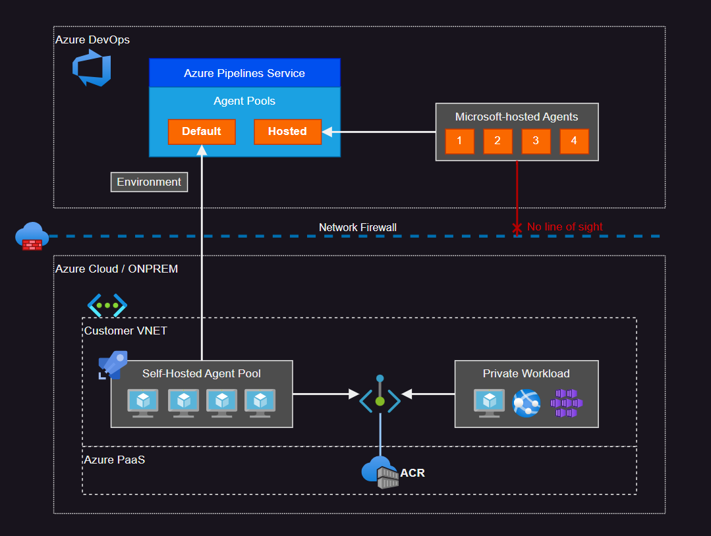
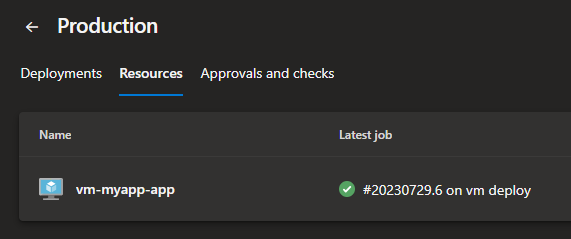

# Azure DevOps Self-Hosted Agent

Demo project for following the [documentation][1] for Linux.



To create the infrastructure:

```sh
terraform init
terraform apply -auto-approve
```

On Azure DevOps:

1. Create a project
2. Create a PAT with Agent Pools and Deployment permissions
3. In Agent Pools, select the "Default" and Linux
4. Follow the steps to install the agent
5. Configure the agent as a service

When completed, the agent will be online:


Create a pipeline based on the [`app/azure-hello.yaml`](app/azure-hello.yaml) file in this repo. It is set up to use a self-hosted agent.

Run the pipeline.

> 💡 You'll need to give permissions to the pipeline

## Docker build/push to ACR

The pipeline [`app/azure-acr.yaml`](app/azure-acr.yaml) will build and deploy to ACR.

Create a service connect for Docker Registry and select the option "Others". Create the 

Now create the pipeline that will build and push to ACR. Change the `containerRegistry` attribute as required.

```yaml
steps:
- task: Docker@2
  inputs:
    containerRegistry: 'acr-docker-others'
    repository: 'myapp'
    command: 'buildAndPush'
    Dockerfile: '**/Dockerfile'
```

## Deploy to a VM environment

Following the VM deploy environment [docs][3], create an environment called "Production".

Register the VM as a resource, like `vm-myapp-app`.

Create the pipeline referencing [`app/azure-deploy.yaml`](app/azure-deploy.yaml) with the `ACR_ADMIN_PASSWORD` secret.

Run the pipeline to pull and run the previously built image.




## Develop the local Docker app

To check if the code in `app` directory is running:

```
docker build -t hello .
docker run --rm -p 3333:3333 hello
```

## Reference

- [Example article][2]
- [Azure Code Deploy][4]

[1]: https://learn.microsoft.com/en-us/azure/devops/pipelines/agents/linux-agent?view=azure-devops
[2]: https://medium.com/@cocci.g/set-up-an-azure-devops-self-hosted-agent-5cd9b009b509
[3]: https://learn.microsoft.com/en-us/azure/devops/pipelines/process/environments-virtual-machines?view=azure-devops
[4]: https://learn.microsoft.com/en-us/azure/devops/pipelines/ecosystems/deploy-linux-vm?view=azure-devops&tabs=javascript
