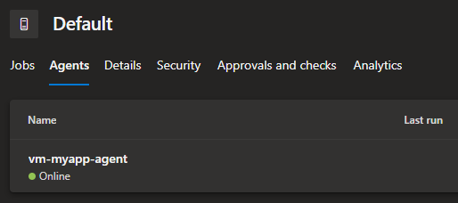

# Azure DevOps Self-Hosted Agent

Demo project for following the [documentation][1] for Linux.

To create the infrastructure:

```sh
terraform init
terraform apply -auto-approve
```

On Azure DevOps:

1. Create a project
2. Create a PAT with Agent Pools and Deployment permissions
3. In Agent Pools, select the "Default" and Linux
4. Follow the steps to install the agent
5. Configure the agent as a service

When completed, the agent will be online:



Create a pipeline based on the `app/azure.yaml` file in this repo. It is set up to use a self-hosted agent.

Run the pipeline.

> 💡 You'll need to give permissions to the pipeline

## Reference

- [Example article][2]

[1]: https://learn.microsoft.com/en-us/azure/devops/pipelines/agents/linux-agent?view=azure-devops
[2]: https://medium.com/@cocci.g/set-up-an-azure-devops-self-hosted-agent-5cd9b009b509
